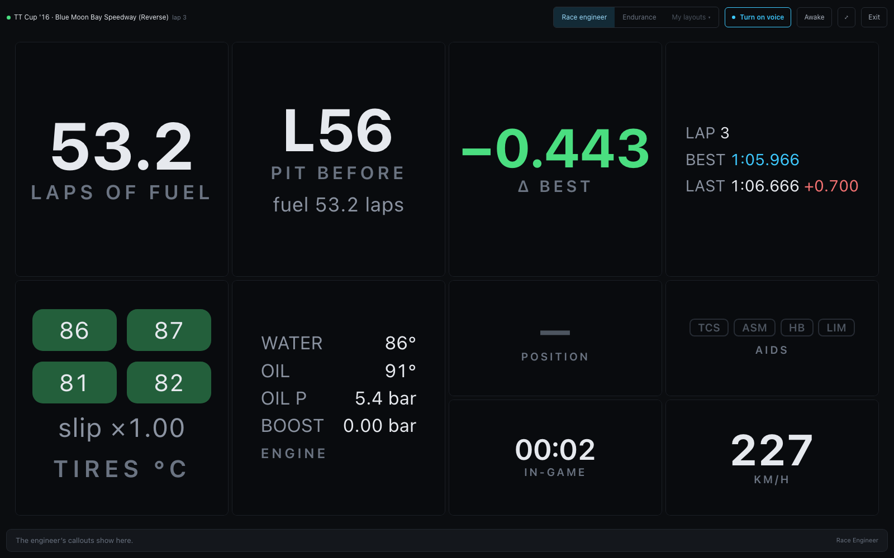

# Driver dashboard

**`/dash`** is a full-screen race-engineer screen for a second display (or a tablet on
the wheel stand) while you drive. It uses the same widget grid as the
[overlay](overlay.md), tuned for glanceability: dark page, big numbers, a full-width
**alert banner** that only appears when something needs attention, and the Race
Engineer's last callout pinned at the bottom.

```
http://<host>:8000/dash                      # built-in Race engineer preset
http://<host>:8000/dash?preset=endurance     # built-in Endurance preset
http://<host>:8000/dash?layout=my-dash       # a layout you saved in the builder
http://<host>:8000/dash?demo=1               # placeholder data for a dry run
```



## The top bar

- a **status dot** (green = live telemetry, amber = placeholder, red = waiting), the
  car, track, lap and position;
- the layout picker: the built-in presets (**Race engineer**, **Endurance**) and
  **My layouts ▾** — your saved dash layouts. Tapping the dash itself also steps to
  the next layout;
- the voice button: **Turn on voice** until you tap it (browsers need that tap before
  they may speak), then *Voice · speaking here*, *Voice · another device* or *Voice ·
  not working* — each a link to the [Race Engineer page](race-engineer.md#the-engineer-page);
- **Awake** — keeps the screen on (the browser's wake lock; it needs HTTPS or
  localhost). Turning on voice also asks for it;
- **⤢** full screen, and **Exit** back to the Live view.

The bar fades after five seconds without a touch, and comes back on the next one — a
tap that only wakes the bar does not also change the layout.

Under the grid, a caption strip shows the Race Engineer's last callout (switch it off
under **On-screen captions** on the Race Engineer page).

## Built-in presets

- **Race engineer** (default) — fuel laps remaining, pit-window countdown, live
  Δ-to-best, and lap times in the middle; tire temps + slip, detailed engine health,
  position, clock, driver-aid badges, and speed below.

The **delta ticks live during the lap**: once a session-best lap exists, it shows the
gap at your current track position vs where the best lap was at the same point
(green = gaining, red = losing). On the first lap of a session — before any reference
exists — it falls back to the end-of-lap comparison, labeled *Δ best (last lap)*.
- **Endurance** — fuel is the hero readout, with a wide engine-health panel, fuel
  summary, clock, position, and lap times.

To customize one, open the **Overlays** tab, start from a dash preset (**Start from a
preset**), rearrange/restyle the widgets, and save it under a name with the kind set
to **Driver dash** — then pick it under **My layouts** or open `/dash?layout=<name>`
on the driver screen. Saved dash layouts always render full-screen on a dark page,
whatever canvas the builder showed. A layout whose top row is a full-width `alerts`
widget has that row dropped here, since the dash's own alert banner says the same.

## Race alerts

The dash's alert banner (and the `alerts` widget, on overlays) turns telemetry into
race-engineer warnings, sorted most-critical first. The banner shows the most urgent
one, with `+N more` and the fuel range beside it; critical is red, warnings amber.

| Alert | Fires when |
| --- | --- |
| `FUEL n LAPS` | projected fuel < 3 laps (warning) / < 1.5 laps (critical, pulsing) |
| `PIT THIS / NEXT LAP` | the projected pit lap is upon you (lapped races only) |
| `Water n °C` | > 110 °C warning · > 120 °C critical |
| `Oil n °C` | > 130 °C warning · > 140 °C critical |
| `OIL PRESSURE` | < 2.0 bar with the engine above 2000 rpm (critical) |
| `Tires hot` | any tire > 110 °C |

Fuel projections use the rolling 3-lap average, the same numbers as the strategy
widget. Alerts are suppressed while off-track or paused, so menus don't scream at you.
The engine and tire widgets color their readouts with the same thresholds.

Every widget's styles, thresholds, and behavior under each track condition (paused,
menus, first lap, race finished, lost telemetry, …) are documented in the
[widget reference](widgets.md).
