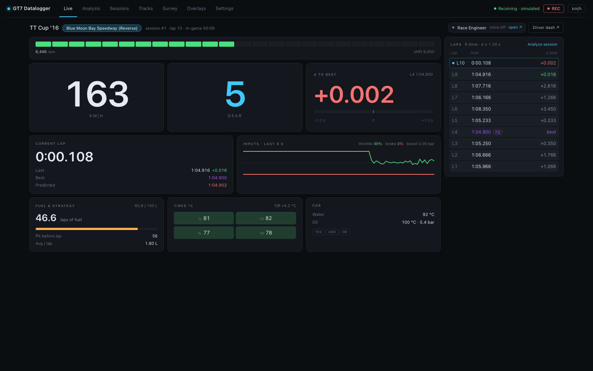

# Live view

`#/live` — the default view. Big race readouts that update continuously from the
telemetry stream while you drive.

## Context strip

Across the top: the car, the track badge, and a line with the session number, the lap
(`lap 4/10`, or `finished` after the flag), the race position (`P3/16`) and the
in-game time of day, plus *paused* / *not on track* when they apply.

On the right, two links to the second-screen pages:

- **Race Engineer** chip — whether the server's voice callouts are going anywhere:
  *speaking on this browser* / *a Driver dash* / *an Engineer page* with the
  verbosity, *voice off*, or *callouts off*. Click it to open the
  [Engineer page](race-engineer.md). The Live view itself never speaks.
- **Driver dash ↗** — the [driver dashboard](dash.md).

## Alert strip

When something needs attention, a strip under the context line spells it out, most
critical first: fuel (*Fuel for 2.4 laps — box before lap 12 at 3.10 L/lap.*), pit
window, water and oil temperature, oil pressure, tires. The triggers are the same as
the [driver dashboard's alerts](dash.md#race-alerts). Nothing shows while all is well,
or while you're off track or paused.

## Readouts

**Shift lights** — a 24-segment strip filling green, amber, then red from 45 % of
the shift point up to it; at the shift point everything lit turns red, and on the rev
limiter the strip flashes. Under it: current RPM and the shift point.

**Speed** — converted to your units setting (toggle km/h ↔ mph in the status bar).

**Gear** — `R` for reverse, `N` for neutral. When the game suggests a different gear,
a `gear → N` hint appears under the number (amber while you're braking).

**Δ to best** — the live gap at your current track position to the session-best lap
at the same point, with a ±1.0 s bar (green gaining, red losing) and the reference
lap's number and time. Before a live reference exists it falls back to the last lap
against the best, labelled *Δ best · last lap*.

**Current lap** — the running lap time, with **Last** (and its gap to the best before
it, purple for a new best), **Best**, and **Predicted** — the best plus the live delta.

**Inputs · last 8 s** — a rolling throttle (green) and brake (red) trace, with the
current percentages, and boost (`x.xx bar`) on turbocharged cars.

**Fuel & strategy** — fuel left / capacity and, once you have completed a lap that
burned fuel, **laps of fuel** projected from a rolling average of the last 3
fuel-consuming laps, with **Pit before lap** (the last lap you can complete on this
tank), **Avg / lap**, and — in races with a known length — **To finish**: green
*fuel OK*, or red *x.x L short*. See [Fuel & race strategy](../internals/fuel-strategy.md)
for the math.

**Tires °C** — the four tire temperatures in a 2×2 layout, tinted by temperature:
blue below 55 °C (cold), green 55–95 °C (optimal), red at 95 °C and above (hot), with
the front/rear balance. A `TIRE SPIN` warning appears when average slip exceeds 1.1×.

**Car** — water and oil temperature (amber / red at the
[alert thresholds](dash.md#race-alerts)), oil pressure, and three **driver-aid
pills** — `TCS`, `ASM`, `HB` — that light amber while that aid is actively
intervening.

## Laps rail

On the right: this session's laps. The lap in progress is pinned at the top with its
running time and live Δ; below it, every completed lap newest first with its time
and Δ to the session best (the best marked **PB** in purple; laps that don't count
show no delta). The header counts the laps and gives their consistency (σ). **Click
any lap to open it in the Analysis view**; **Analyze session** opens the whole
session.

## Status bar (all views)

- **Telemetry pill** — *Receiving* (green; *Receiving · simulated* on the
  simulator), *No telemetry* (amber: server up but no telemetry — check console IP /
  UDP 33740), or *Offline* (red: the browser lost the server). Click it to open
  [Settings › Connection](settings.md#connection).
- **● REC / paused** — toggle lap recording on/off.
- **km/h / mph** — units toggle, persisted in the browser.

## No telemetry

Before any telemetry arrives — or after 5 s without a frame — the view hands over to
a *No telemetry* page: a live checklist of what is missing (server, browser ↔ server,
console discovery, GT7 in a session), with **Set console IP** and **Use simulated
source**. Start driving in GT7, or switch to the simulator to try things out without a
console.
