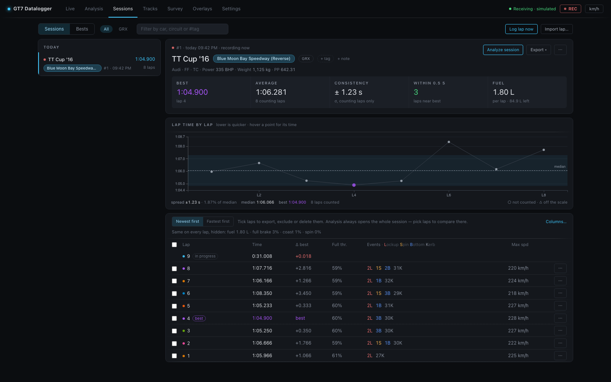

# Sessions view

`#/sessions` — your lap archive. Sessions are created automatically (split on car change
or race restart — see [Lap detection & sessions](../internals/lap-detection.md)).

The view is master–detail: the session list on the left, the chosen session on the
right. Two sub-tabs sit top left — **Sessions** and **Bests** (the
[Bests board](bests-view.md)) — with the category chips, a search box and the
[header actions](#header-actions) beside them.

## Session list

Sessions are listed newest first and grouped by date (*Today*, *Yesterday*, the
weekday for the rest of the week, a date before that). Each entry shows the car, its
best lap, the track, the session id and start time, and the lap count. The session
being recorded carries a pulsing red dot.

The track is shown as a **badge** when it is known, and as *unnamed circuit* when it
isn't.

**Filter by car, circuit or #tag** narrows the list as you type; `#wet` matches the
tag.

## Session detail

The header of the chosen session holds:

- the session id, start time (and *recording now* for the live session), the car and
  its published figures (manufacturer, drivetrain, aspiration, power, weight, PP —
  hover for the full list);
- the track badge, or a dashed **name track…** button when the track is unknown.
  Naming it fingerprints the circuit from the session's first lap, and **every future
  session on that track is tagged automatically** — see
  [Track identification](../internals/track-identification.md);
- chips for the class, the [race result](#race-results), *excluded from bests*, and
  the [tags](#notes-tags), with **+ tag** and **+ note**;
- **Analyze session** — opens the session in Analysis, where you pick the laps to
  compare;
- **Export ▾** — [Session ZIP, Session analysis, All laps · CSV](#exports);
- **⋯** — **Exclude from bests** / **Include in bests**, **Name track…** (when the
  track is unknown), and **Delete session…**.

Under it, a **stat strip**: **Best** (and which lap), **Average** of the counting
laps, **Consistency**, **Within 0.5 s** (how many counting laps are within half a
second of the best), and **Fuel** per lap — with the fuel left in the tank for the
session you are driving.

**Consistency** is the standard deviation of the lap times, taken over the laps that
[count toward bests](#excluding-a-lap-from-bests) only; it needs three of them.
Race opening laps labelled **excluded · race start** do not enter this figure.

Then the **Lap time by lap** chart — every lap's time in order, the best in purple, a
dashed median line and the spread band; its footer gives the spread as a percentage
of the median. It is the same chart as
[Analysis's](analysis-view.md#side-panels). Clicking a point ticks that lap in the
table below.

## Category filter

When GT7 broadcasts the car's class (packet C — "Gr.3", "Gr.4", "N300"…), it appears as
a chip on the session and in a strip of filter chips at the top: *show me only the
Gr.3 runs*. The same chips filter the Bests sub-tab. Only
classes actually present are offered, so the strip disappears entirely on a history
recorded before packet C, and **All** is the only way back to sessions that have no
class at all. A session whose own class is blank — its very first packet was a narrower
format — takes the class its laps recorded.

## Race results

A session that saw the checkered flag carries its result: a **P3/12**-style chip in the
header, with the race length and — when it can be known — the total race time in the
chip's tooltip. The result is written once, at the moment GT7's lap counter passes the
race distance, so it means *position at the finish*:

- A **time trial** (GT7 reports no positions there) shows no chip — "no race" is kept
  distinct from finishing last.
- A session that **ended mid-race** (stream stopped, race restarted) claims no result
  either, however well it was going at the time.
- The **total race time** is the sum of the stored lap times, and is only stated when
  every lap of the race is accounted for — a dropped stream or a mid-race join leaves a
  gap, and a sum across a gap would be confidently wrong, so the tooltip simply omits
  it. (GT7 broadcasts no total-time field, and the in-game clock runs at the event's
  own day-speed multiplier, so neither is a substitute.)

In race sessions the lap table also gains a **Pos** column — the position each lap was
completed in, which is what makes the race readable after the fact: the lap you gained
two places on is right there next to its time. Per-tick position is recorded too, as
the **Race position** channel in [Analysis](analysis-view.md#channel-picker).

## Notes & tags

The session header edits two user-set fields in place:

- **Notes** — free text, up to 500 characters: setup changes, conditions, what to try
  next. **+ note** opens the editor; **Save note** saves it, Escape cancels. A saved
  note shows under the car line; click it to edit.
- **Tags** — short repeatable labels ("wet", "race sim", "testing new diff"). **+ tag**
  opens a field; Enter adds the tag. Click a tag to filter the list by it (`#wet`),
  and its **×** to remove it.

Tags are deduplicated case-insensitively, limited to 40 characters, and may not contain
commas. Both fields save through the same admin-gated PATCH as the bests toggle below,
and editing one never disturbs the other.

## Excluding a session from bests

Each session's **⋯** menu offers **Exclude from bests** (and **Include in bests** to
undo it); an excluded session says so with a chip in its header. It exists because of replays:
GT7 streams a replay exactly like driving — no flag distinguishes them — so watching
the time-trial leader's lap [records it](../internals/lap-detection.md#replay-salvage)
into *your* history, and nothing in the telemetry can tell that lap from one you
drove. Left alone it would own a row on the [Bests board](bests-view.md) and stand as
the class benchmark under your name.

An excluded session keeps every lap, and its laps stay selectable in Analysis —
overlaying your line against the leader's is the whole point of capturing the
replay — but it never owns a Bests row and never provides the
[class benchmark](analysis-view.md#side-panels). The toggle is admin-gated when
`GT7_ADMIN_TOKEN` is set, like every other mutation.

## Excluding a lap from bests

The session toggle is for laps that aren't yours. For your own laps that shouldn't
stand — an off-track moment, contact, a restart, a lap you know was dirty — each row of
the lap table has **Exclude from bests** in its **⋯** menu (or tick several laps and
use the bulk bar). The lap leaves every best at once: the session best, the
[Bests board](bests-view.md), the [class benchmark](analysis-view.md#side-panels),
and the Race Engineer's pace and coaching comparisons. The lap is dimmed and an
**excluded · why?** picker appears beside its number — *off-track*, *contact*,
*restart*, *dirty*, *pit-out* or *race start* — and the Bests board shows that reason
next to the time it replaced.

It works the other way too. The
[partial-lap guard](../internals/lap-detection.md#best-lap-tracking) marks laps it
thinks covered only part of the track as **partial**, including laps that
[began away from the line](../internals/lap-detection.md#where-a-lap-begins).
If the guard got one wrong, **Count for bests** in the lap's **⋯** menu makes it count (**kept**). Setting a lap back to what the guard says
hands it back to the guard, so a lap you excluded and then counted again follows the
guard again rather than staying pinned.

**Race opening laps** are automatically excluded with the reason **race start**,
for both standing and rolling starts. Detection requires lap 1 and a packet during
that lap reporting a positive race distance and a position in a field of at least
two. A complete opening lap keeps its full-lap verdict; its starting conditions are
why it is excluded. Qualifying lap 1 and the first recorded lap of a mid-race join
are not excluded by this rule. If race metadata is missing, use **Exclude from
bests**, then select **race start** yourself. **Count for bests** can include it again.

Existing sessions with a recorded race result are updated once at startup, leaving
any existing manual rulings intact. Older recordings without a confirmed result
need a manual ruling.

An excluded lap keeps its row, its telemetry and its place in Analysis. If the lap belongs to the session you are driving right now,
the live session best and the Δ-best reference move with it immediately. The ruling
is admin-gated when `GT7_ADMIN_TOKEN` is set.

## Lap table

Per lap: its colour (the same colour it gets in Analysis charts and maps; the fastest
lap is purple), number, time, **Δ best** (to the session best), position (races
only), fuel used, full-throttle %, full-brake %, coasting %, tire-spin %, events, and
max speed. **Newest first** / **Fastest first** sorts it.

**Columns that never change are hidden.** A column that reads the same on every
counting lap — the same fuel use on a fixed-fuel run, 0 % spin — is dropped, and a
line above the table lists what was hidden and its value (*Same on every lap, hidden:
fuel 1.80 L · spin 0%*). **Columns…** shows or hides any column by hand;
**Automatic — hide what never changes** goes back to the default.

A lap that does not count toward bests is dimmed and labelled: *partial*, *kept*, or
*excluded · reason* (see [above](#excluding-a-lap-from-bests)). A salvaged lap
carries **⟲**.

**The lap in progress.** While you are driving the session, the lap being driven is
pinned above the completed laps (*in progress*), its time and Δ to the session best
ticking live. It joins the table as a normal row when it completes.

The **Events** column is a compact code — `2L·1S·3B·1K` means 2 lockups, 1 wheelspin,
3 suspension bottomings, 1 kerb strike; `–` means a clean lap.

Off-track excursions ride in the same column, as red `⚠` counts, and can carry two
figures, because two different judges watch the lap (hover for the words). The first
counts excursions by GT7's own per-wheel surface
flags (three or more wheels on the loose) — which are blind to paved run-off:
running wide over asphalt reads as tarmac and stays "clean". The second
appears once the circuit has been [surveyed](tracks-view.md) well enough
(≥ 50 % of the road resolved): the lap's positions are judged against the
**surveyed edges**, and sustained excursions beyond them count even on
pavement. Unsurveyed stretches never count against a lap, and laps recorded
before the session was identified are re-judged the moment it is. Where the
circuit crosses over itself, the lap's elevation says which level it was on;
laps recorded before elevation was stored (0.6.1 and earlier) are judged
against both levels there and get the benefit of the doubt. A lap is *clean*
only when both judges agree.

The survey's verdict follows the survey. Whenever a circuit's bundle changes —
a survey run stops, a bundle is merged in, renamed or deleted — every lap ever
driven there is judged again against the road as it now is, so a lap a bad
survey flagged reads clean again once the survey is corrected, and a lap
judged against a bundle since deleted goes back to *unknown* on that count.
The surface-flag verdict is GT7's own and never moves. **Re-check laps** on
the [Tracks view](tracks-view.md) forces the pass and says how many verdicts
changed.

**Tick laps** (the checkboxes, or click a row) to act on several at once: a bar
appears at the bottom with **Exclude from bests**, **Export laps** (one JSON file per
lap) and **Delete…**. Ticking is only for acting on laps — Analysis always opens the
whole session, and the comparison is picked there.

Each row's **⋯** menu:

| Action | What it does |
| --- | --- |
| **Open in Analysis** | opens Analysis with this lap vs the session's best (best as reference) |
| **Set as reference** | opens Analysis with this lap as the reference |
| **Export JSON** | downloads the lap as `gt7-lap-<id>.json` — the full 60 Hz recording, shareable and re-importable |
| **Export CSV** | downloads a **MoTeC-compatible CSV** for MoTeC i2 or Excel |
| **Exclude from bests** / **Count for bests** | see [above](#excluding-a-lap-from-bests) |
| **Delete…** | removes the lap and its telemetry (confirmed, irreversible) |

## Exports

**Export ▾ → Session ZIP** in the session header downloads the whole session as
`gt7-session-<id>.zip`: every lap's `.json` file plus a `session.json` with the car,
circuit, tags, note and race result — a backup or a hand-off in one click. See
[Session archive](../reference/lap-file-format.md#session-archive-zip).

**Export ▾ → Session analysis** downloads `gt7-session-<id>-analysis.json`, the
session's **lap analysis**: every lap measured corner by corner against the session's
best lap, in one small file. For each corner of each lap it says where the brake went
on and came off, how hard it was pressed and whether it was still on when the car
turned in; the slowest speed and where it was; where the throttle came back and
reached full; the time lost in the corner and on the straight before it; how far off
the best lap's line the car ran; and, on a surveyed circuit, how much road was left
on each side. It also carries each lap's fuel, tyre temperatures and aids use, the
upshift RPM per gear, and how consistent each corner was across the session.

It is a file to hand to something that will read it — a coach, a spreadsheet, an
assistant — rather than one to look at: about 100 KB where the session's recordings
are tens of megabytes, with every number labelled. The same file is inside the
session ZIP as `analysis.json`. See
[Lap analysis format](../reference/lap-analysis-format.md).

**Export ▾ → All laps · CSV** downloads one MoTeC-compatible CSV per lap.

**⋯ → Delete session…** removes the session and all its laps. The session **being
recorded** is protected while recording is on, through pauses, pit stops and
connection drops alike: pause recording with the **● REC** button in the status bar
first, and the view says so if you try without. Deleting it then also discards its
unfinished lap, and recording again starts a fresh session. Older sessions can be
deleted while recording continues.

## Header actions

- **Log lap now** — saves the in-progress lap immediately without waiting for the start
  line. Handy for capturing a partial run or a test.
- **Import lap…** — load a `.json` lap file exported from any GT7 Datalogger instance.
  Older v1 files import cleanly; the newer per-corner channels are simply absent and
  the charts skip them. Events and aid metrics are recomputed from the samples on
  import. The lap lands in the **currently live session** when one is open (otherwise
  a fresh "imported" session), and keeps the verdicts it was exported with — a
  partial or [excluded](#excluding-a-lap-from-bests) lap stays that way — so otherwise
  it counts toward [bests](bests-view.md) like any lap. Someone else's lap belongs in a
  session you [exclude from bests](#excluding-a-session-from-bests). A session
  archive's lap files import one at a time the same way.

## Recording control

The **● REC / paused** toggle in the status bar pauses lap recording globally — the
live view keeps streaming, but nothing is written to the database until you resume.

See [Lap file format](../reference/lap-file-format.md) for what's inside the JSON and
CSV exports.
