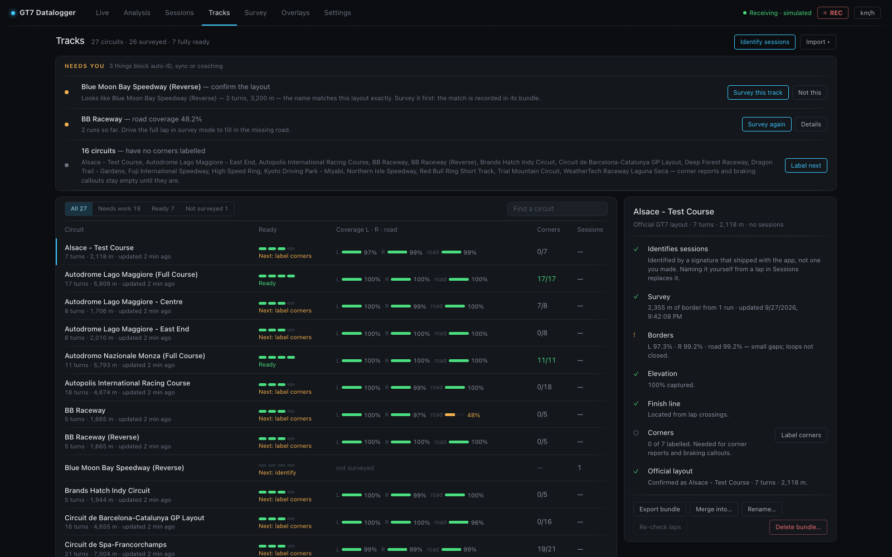

# Tracks view

**What do I have, and what is missing.**



The page reads top to bottom: a **Needs you** list of what blocks
auto-identification, sync or coaching; a **readiness table** of every circuit;
and, beside it, a **checklist** for the selected circuit.

Three separate things can be true about a circuit, and until this view existed
nothing on any screen showed them together:

| you have | which means | where it lives |
|---|---|---|
| a **named track** | a five-number signature sessions can match against — one you wrote, or one that shipped with the app | the `tracks` table |
| a **survey bundle** | its borders, elevation and finish line are mapped — *and* sessions driven on it identify themselves | `data/track-bundles/` |
| an **official layout match** | its real length and turn count are known | `backend/data/tracks.json` |

Having one is not having the others: a named track you have never surveyed has
no map. The Tracks tab lists every circuit this installation knows anything
about, merged across all three, with the gaps called out.

## Identifying sessions

Most circuits recognise themselves before you have done anything at all: the
app ships signatures for 78 GT7 configurations, so a session at one of them is
named on its first completed lap. Those circuits say *named by shipped
signature* (and the checklist explains it) to keep them apart from circuits you
named yourself — and a name you write always wins
over one the build supplied, so naming a circuit yourself is how you correct a
shipped name you disagree with.

A surveyed circuit recognises itself too. When a new session's first lap has no
matching signature, the lap is compared against the survey bundles — *did this
lap drive on this tarmac?* — and a confident match names the session. That is
what makes the track badge, the surveyed road under the
[race line](analysis-view.md#race-line-map), category bests and corner labels
appear without anyone naming anything. See
[Track identification](../internals/track-identification.md#matching-against-a-survey-bundle).

Sessions recorded **before** a circuit was surveyed never got that chance.
**Identify sessions** (top right) re-runs identification over every unlabelled session in
your history and names the ones it can now place — whether that is a circuit
you have since mapped, one you have since named, or one the app ships a
signature for. Sessions with no confident match are left alone — an unlabelled
session is honest, a mislabelled one is not.

## Needs you

The panel at the top gathers everything that is waiting on a decision or a drive,
each with the button that fixes it:

- **confirm the layout** — a circuit that looks like an official GT7 configuration
  (see [below](#confirming-the-official-layout)), with **Confirm** and **Not this**;
  **Survey this track** instead when there is no bundle yet to record the match in.
- **went nowhere** — a survey run saved as a log only, with no circuit named (see
  [below](#runs-that-went-nowhere)), with **Assign to a track…** and **Download**.
- **road coverage *n* %** — a bundle with less than half the road found, with
  **Survey again**.
- **no corners labelled** — the circuits whose corner reports and braking callouts
  stay empty until they are, with **Label corners** (or **Label next**).
- **Track sync — not reaching the server** — when tracks sync is on and failing,
  with **Open Settings › Sync**.

It says *Nothing waiting on you.* when there is nothing.

## The readiness table

Filter it with **All**, **Needs work**, **Ready** and **Not surveyed**, or type in
**Find a circuit**. Each row shows:

- **Circuit** — the name, and under it the turn count, length and when the bundle
  was last updated; or, with no bundle, *named by shipped signature* / *named by
  you from a lap*.
- **Ready** — four pips for the steps from a name to working coaching, in the
  order they unlock each other: **identifies sessions**, **surveyed**, **official
  layout**, **corners labelled**. Under them, *Ready* or the next step (*Next:
  survey it*, *Next: confirm layout*, *Next: label corners*). Hover for the list.
- **Coverage L · R · road** — the compiled score: each border's surveyed share of
  the boundary itself, and **road %**, the share of surveyed border with the
  opposite border found across from it. Measured against the boundary, not the path
  you drove — a circuit you lapped fifty times with one unmapped chicane still says
  so. See the
  [compiled geometry](../reference/track-bundle-format.md#compiled-geometry-derived-not-part-of-the-bundle).
- **Corners** — labelled, out of how many the official catalog says the circuit has
  once the layout is confirmed.
- **Sessions** — how many sessions were driven there.
- **Sync** — with tracks sync on, where the bundle stands (see
  [Sync status](#sync-status)).

Circuits that have only a shipped signature and nothing else get **no row** —
they would be 78 lines restating the catalog, burying the rows that record an
actual disagreement. The footer counts them instead, so "nothing here knows
that circuit" and "it is already waiting for you" stop looking identical.

## The checklist

Click a row to open its checklist on the right: one line per fact, ticked, flagged
or still to do, with the fix beside it.

- **Identifies sessions** — and why: you named it, a shipped signature did, or its
  surveyed road does. A circuit named only by a shipped signature says so; naming it
  yourself from a lap in Sessions replaces it.
- **Survey** — metres of border evidence (one record per metre per side), how many
  survey runs are behind it, how many different installations contributed (see
  [importing](#importing-and-sharing)), and when it was last updated.
- **Borders** — the left, right and road coverage, and whether both sides form a
  closed loop.
- **Elevation** — the share of mapped metres that know their height. Bundles
  started before elevation capture sit near zero and **only fill in by
  re-driving**: this number is a fact about the data, not a bug.
- **Finish line** — located from lap rollovers, which GT7 does exactly on the
  line.
- **Corners** — how many are labelled, with **Label corners** / **Edit corners**.
- **Official layout** — confirmed, suggested (with **Confirm** and **Not this**),
  or not matched.
- **Sync** — with tracks sync on, the bundle's chip and what it means, with **Sync
  now** when it is queued or failed.

Under the checklist: **Export bundle**, **Merge into…**, **Rename…**, **Re-check
laps** and **Delete bundle…**.

## Runs that went nowhere

A survey with no circuit label saves **no bundle at all**. A run that starts
before the track is identified, and never gets named, accumulates border
evidence against nothing — the author lost about 55 minutes of driving that
way, with no screen anywhere reporting it.

Those runs are not gone: the JSONL log of a survey is a complete record, and
the Tracks view lists every orphaned one under **Needs you** with an
**Assign to a track…** button. Assigning replays the log through the normal
merge path, so the result is identical to having named the circuit while
driving.

(The same job from a terminal, for a log that has been moved off the machine
that recorded it, or for a dry run first:
`python scripts/jsonl_to_bundle.py <log.jsonl> <data_dir> "<Track>"`.)

## Confirming the official layout

When the name looks like an official GT7 configuration, **Needs you** and the
checklist offer the match with its reasoning — the name, and the measured lap
length where the circuit has also been named. **Not this** rules a suggestion out
(on every device) and offers the next-best layout, if one is close enough;
**Suggest again** in the checklist forgets the ruled-out ones.

You confirm it; the app never applies it silently. **GT7 broadcasts no track
identifier**, and the catalog carries no world coordinates, so nothing on
either side identifies the other and the match is genuinely a guess. A wrong
one would attach the wrong turn count and quietly mislead every "15 of 17
corners labelled" readout afterwards.

Confirming stores the match in the bundle, so it travels with export.

## Two names, one circuit

Bundle names are typed by a driver and then slugified, so "Lago Maggiore -
East" and "Lago Maggiore - East End" become two bundles of the same tarmac,
each with half the evidence. **Rename…** onto an existing name merges them:
one circuit is one bundle.

## Re-checking laps

A lap's off-track verdict against the surveyed edges (see the
[Sessions view](sessions-view.md#lap-table)) is decided against the
survey as it was when the lap was saved. The survey keeps changing, so the
app re-judges every lap on a circuit whenever its bundle does: two minutes
after a survey run's last save, and at once after a merge, a rename or a
delete. A corrected survey clears the flags a bad one caused; a deleted one
takes its verdicts back to unknown.

**Re-check laps** in the checklist forces that pass for one circuit and says what it found —
"Re-checked 143 laps on Deep Forest — 7 verdicts changed", or that every
verdict stands. It reads every lap's telemetry, so on a circuit with hundreds
of laps it takes a few seconds. It is there for when you do not want to wait,
and for a survey deleted before the app did this by itself.

## Labelling corners

**Label corners** (or **Edit corners**) opens the refine view: the circuit's surveyed map, with clicking
placing corner apexes.

This exists because `detect_corners()` runs **per lap**, off the racing line.
A driver who straightlines an S takes the same tarmac on a shallower arc,
detection stops calling it a corner, and every corner after it renumbers — so
"turn 4" means a different piece of tarmac from one lap to the next. Anything
built on comparing corners across laps or sessions needs numbering that holds
still, and hand-labelled corners do.

Click **Place corners** and work around the map from the first corner after
the start line, then name them. Per corner you can optionally mark turn-in
(**entry**) and **exit**, and set the direction. **Sections** below the corner
list mark named stretches — the input real sectors need, since GT7 broadcasts
none.

Corners are stored **in the bundle**, not the database: they are knowledge
about the circuit, so they travel with export and import, and they are a large
part of what makes someone else's bundle worth pulling.

Once labelled, they take over from detection everywhere:

- the Analysis race-line map and corner detail use them, so corner 4 is corner
  4 in every session;
- the Race Engineer speaks the name — "you lost three tenths in the
  Parabolica" rather than "in turn four".

## Importing and sharing

Contributed bundles live in their own repository —
[**gt7-datalogger-track-data**](https://github.com/jbhoorasingh/gt7-datalogger-track-data)
— with a [browsable map of every circuit in
it](https://jbhoorasingh.github.io/gt7-datalogger-track-data/). A fresh
installation — one holding no bundles yet — pulls every circuit from it once,
in the background, on its first start, so the known circuits are named and
drawn from your first lap. After that, **Import ▾ → Pull all from shared**
pulls everything again (only what changed is added), and **Import ▾ → Pull
from shared** lists every circuit the repo offers, says whether you already
hold a bundle of it, and **Pull** fetches and merges one. (The repo is
configurable via `GT7_SHARED_BUNDLES_URL`; setting it empty turns pulling off,
the first-start pull included. An installation offline at its first start
tries again at the next.) Alternatively, grab the pack
from the repo's latest release, unzip, and run its `import_into_app.py`
against your datalogger; or download a single track from the site and use
**Import ▾ → Import bundle…**.

A pull brings the repo's **corrections** for the circuit along with its
bundle, when it keeps some (the *Pull from shared* list says *corrected*): the areas an editor
decided the map should not draw — a pit wall recorded as the border, a
stretch surveyed on the wrong side — and the borders somebody drew in, a
bridge across a gap nobody has driven. They are the repo's decision about
the evidence rather than evidence, so they are never merged into your
bundle: the app keeps the repo's file beside it, compiles the map from what
is left, and replaces the file on the next pull (a circuit the repo has
stopped correcting loses it). The upshot is that the road drawn and judged
against here is the road the repo's own map shows. The pack's import script
does the same, and the [API](../reference/api.md#track-bundles-management) takes a corrections
file directly. Your own evidence is untouched either way, and a correction
never travels back up with a sync upload.

The data is separate from the app on purpose: it changes every time somebody
drives, and a corrected corner label should not have to wait for a software
release.

### Sync status

With a sync service connected and **tracks** switched on
([Settings › Sync](settings.md#sync)), your surveys go the other way without a
manual step: every bundle with a confirmed official layout is uploaded once
it has settled after a change, corner labels included, and each row here
carries a chip saying where it stands (the table's **Sync** column, and the
checklist's **Sync** line).

What goes up is **your own evidence**: the votes this installation cast,
with the corner labels, sections, finish crossings and confirmed layout.
Evidence you pulled from the repo or imported from a friend's file stays in
your bundle and never leaves with an upload — the service files every
installation under one account and refuses a document that names somebody
else's, and the repo only ever wanted the metres you added. So pulling never
stands in the way of syncing, and a bundle you pulled but have not surveyed
yourself has nothing to send.

| chip | meaning |
| --- | --- |
| **not synced — confirm layout** | the bundle has no confirmed official layout, so it cannot be filed. Confirm the *Looks like…* suggestion (or set the layout) and it queues itself |
| **not synced — nothing of yours** | every metre in the bundle was pulled or imported; nothing this installation recorded is in it yet. The first survey run here queues it |
| **sync in *N* min** | changed since the last upload; it goes once it has been left alone for ten minutes. A running survey keeps resetting that clock, so a run uploads once, after it stops. **Sync now** in the checklist, or Settings › Sync, sends it at once |
| **syncing…** | uploading now |
| **synced *time*** | accepted by the service; hovering shows the upload id and whether it is still waiting for the next merge run. A word after the time (`held`, `merged`) is the service's own status |
| **sync rejected** | the service refused this document; the reason is in the tooltip. Not retried until the bundle changes |
| **sync error** | the service could not be reached or failed; retried with backoff |

An entry under **Needs you** appears when the service cannot be reached at all.
Nothing here is required: the shared repo can still be contributed to by
exporting a bundle and opening a pull request.

**Export bundle** downloads the bundle document (see the
[format reference](../reference/track-bundle-format.md)) — that file is what
you contribute. **Import ▾ → Import bundle…** merges one in; **Merge into…** in the checklist
does the same but forces the incoming document onto that circuit, which is how
a friend's slightly-differently-named bundle lands in the right place.

Raw survey runs travel too: every JSONL log has a **Download** button (**Needs
you** and the collapsed *Survey logs* section list them all), and
**Import ▾ → Upload survey log…** accepts one recorded elsewhere — assign it to a
circuit and it replays through the normal voting path, credited to the
installation that drove it. That is the finer-grained sibling of bundle
import: a bundle is a circuit's whole accumulated record, a log is one
evening's driving.

Merging accumulates fidelity across people rather than picking a winner. Each
installation stamps a **source id** on every vote it casts, so two people who
each drove a metre once have between them seen it twice — and re-importing the
same shared bundle a second time changes nothing, because each source's own
run count is what advances.

Your own corner labels and your confirmed layout match are never overwritten
by an import.

### Contributing back

The reverse direction — your survey work into the shared repo — is two
commands in a clone of
[gt7-datalogger-track-data](https://github.com/jbhoorasingh/gt7-datalogger-track-data)
(standard-library Python, nothing to install):

```bash
python tools/add_bundle.py --from-app http://gt7.local:8000
python tools/build_index.py
```

then open a pull request. `add_bundle.py` pulls every bundle out of your
running app (or takes an exported file), validates it, and **merges** it into
whatever the repo already holds — the same per-source voting merge as
everywhere else, so re-contributing never double-counts and the PR diff is
only the metres and votes you added. Two things matter before you run it:
**confirm the official layout** (the repo files bundles by `official_id` and
its CI rejects one without it), and ideally label the corners — the
highest-value part of a bundle after the borders. The intended loop is pull →
drive → contribute: start from the shared bundle, extend it, send back the
difference. Details in the repo's
[CONTRIBUTING](https://github.com/jbhoorasingh/gt7-datalogger-track-data/blob/main/CONTRIBUTING.md).

Imported documents are validated field by field before anything is merged: an
import writes into the same store the app surveys into, so a malformed or
hostile document is rejected outright, not partially applied.
