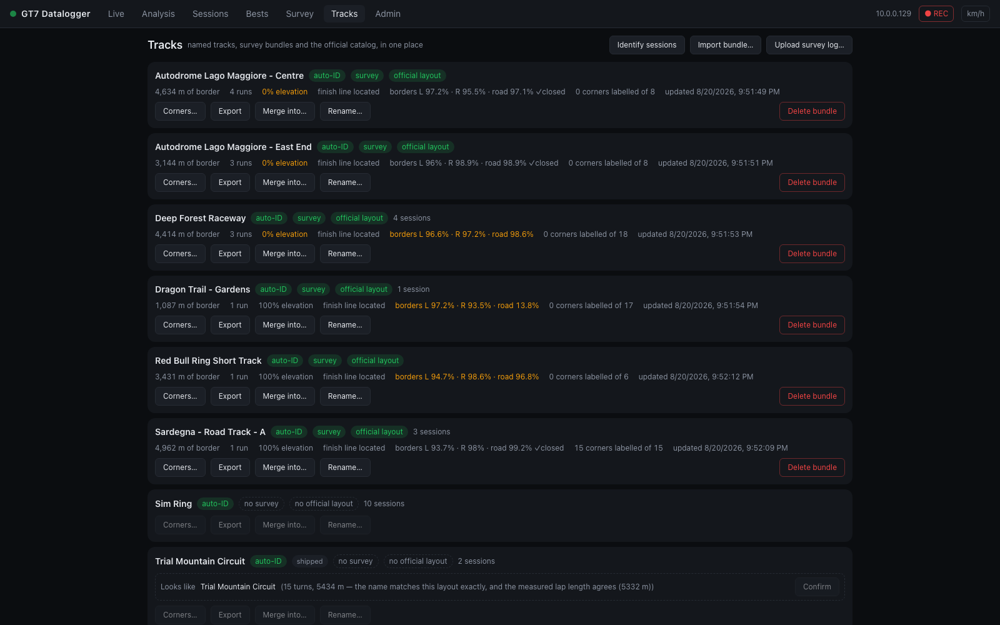

# GT7 Datalogger

A telemetry datalogger and analysis dashboard for **Gran Turismo 7**. It captures the
PlayStation's live telemetry stream, records every lap, and serves a modern dark-themed
web dashboard for live driving, lap comparison, race strategy, and session management.


## What it does

GT7 streams encrypted telemetry over UDP at 60 Hz while you drive. GT7 Datalogger:

1. **Captures** that stream — Salsa20 decryption, heartbeat keep-alive, auto-discovery,
   automatic reconnect.
2. **Records** every lap — ~28 channels at 60 Hz including per-wheel slip, per-corner
   tire temps, and suspension travel, plus per-lap aggregates and detected chassis
   events (lockups, wheelspin, bottoming, kerb strikes).
3. **Serves** a web dashboard — live race readouts, multi-lap analysis with synced
   cursors and a race line map, session history, and a fully customizable OBS/phone
   overlay builder.

Everything runs in a single container (or natively on hardware as small as a Raspberry
Pi Zero) and is viewed from any browser on your network.

## Quick start

```bash
GT7_PS_IP=<your playstation ip> docker compose up --build
```

Open <http://localhost:8000> and start driving. No PlayStation handy? Run
`GT7_SOURCE=sim docker compose up --build` for a fully simulated demo.
→ [Full quick-start guide](getting-started/quick-start.md)

## The four views

<div class="grid cards" markdown>

- **[Live view](guide/live-view.md)** — big race readouts: speed, gear, RPM with limiter
  flash, inputs, tires, fuel, delta, driver-aid pills, live strategy, and a clickable
  feed of completed laps.

- **[Analysis view](guide/analysis-view.md)** — overlay multiple laps against a
  reference: ~20 telemetry channels, time-diff over distance, synced cursors, race line
  map, corner detail widget, detected events, and a gearing panel.

- **[Sessions view](guide/sessions-view.md)** — browse history with lap-time sparklines
  and per-lap metrics; export laps as JSON or CSV/MoTeC, import shared laps, manage
  recording.

- **[Overlay & streaming](guide/overlay.md)** — build a custom overlay for OBS, a phone
  dashboard, or a pit-wall tablet: pick and scale widgets, choose layouts and canvas
  sizes, save named presets.

</div>

## Screenshots

**Live view** — race readouts, driver-aid pills, strategy, and the clickable lap feed:


**Sessions view** — lap-time sparklines and per-lap metrics with event counts
(`2L·1S·4B` = lockups · wheelspins · bottoming):


**OBS overlay** — one of the layouts from the overlay builder, at an exact canvas size:


**Driver dashboard** — the Race engineer preset for a second display during the race:


**Tracks view** — what is surveyed, what is named, and what the official layout is:



*Screenshots were captured against the built-in simulated telemetry source, except the
Tracks view, which shows real recorded sessions — an empty one would say nothing.*

## How it works

Curious about the internals? The **How it works** section explains the machinery in
detail:

- [Architecture](internals/architecture.md) — how capture, processing, storage, and the
  UI fit together
- [Telemetry capture](internals/telemetry-capture.md) — the GT7 UDP protocol, Salsa20
  decryption, and every decoded field
- [Lap detection & sessions](internals/lap-detection.md) — how laps are cut from the
  stream and grouped into sessions
- [Derived channels & metrics](internals/derived-channels.md) — the math behind every
  computed channel and per-lap aggregate
- [Chassis event detection](internals/event-detection.md) — how lockups, wheelspin,
  bottoming, and kerb strikes are found
- [Fuel & race strategy](internals/fuel-strategy.md) — the live pit-window and
  fuel-to-empty calculations

## Credits & related projects

GT7 Datalogger has **full feature parity with
[snipem/gt7dashboard](https://github.com/snipem/gt7dashboard)** — the original Python
race-telemetry dashboard — plus additional features: the analysis channel picker,
Corner Detail widget, chassis event detection, track auto-identification, the
overlay builder, and webhook notifications, all rebuilt on a cleaner architecture with
a modern UI.

Also see [MacManley/gt7-udp](https://github.com/MacManley/gt7-udp), a GT7 UDP telemetry
parser for ESP32 / ESP8266 boards and a great reference for the packet format.

The [shipped track signatures](internals/track-identification.md#the-shipped-signatures)
are built from the circuit captures published by
[zetetos/gt-telemetry](https://github.com/zetetos/gt-telemetry) — 84 recorded laps, one
per configuration, released under MIT. Their world coordinates are GT7's own, so they
need no transform to line up with ours, which is what lets a circuit identify itself on
an install where nobody has driven or surveyed anything. Not affiliated; used with
attribution.

This project's own track data lives in
[gt7-datalogger-track-data](https://github.com/jbhoorasingh/gt7-datalogger-track-data),
separate because it changes every time somebody drives rather than every release.

Licensed under the
[MIT License](https://github.com/jbhoorasingh/gt7-datalogger/blob/main/LICENSE).
